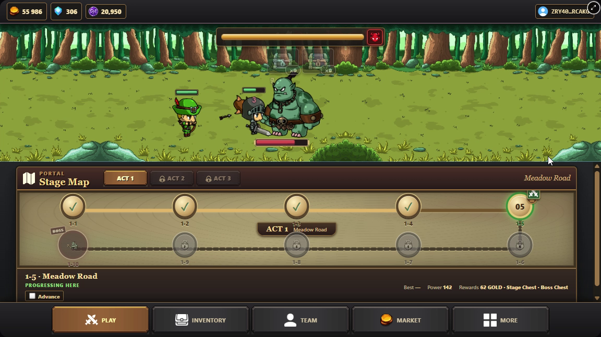
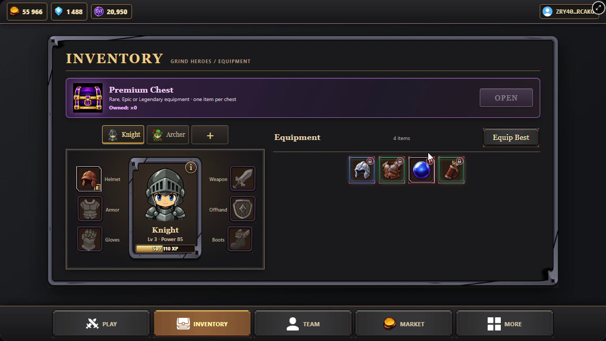
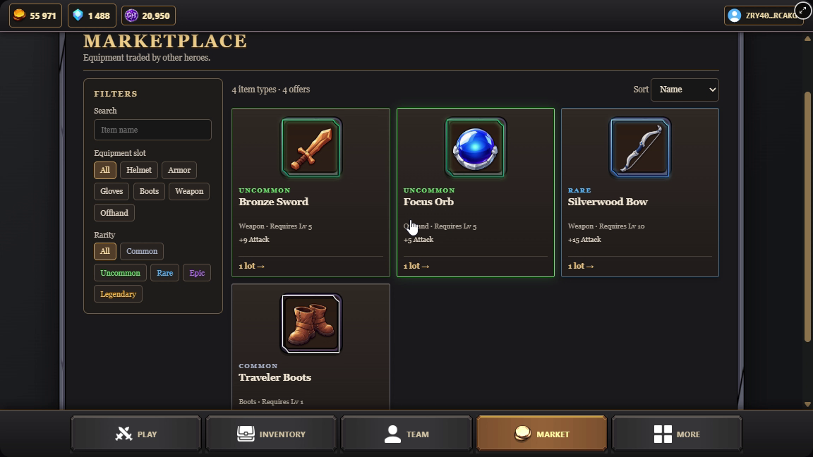
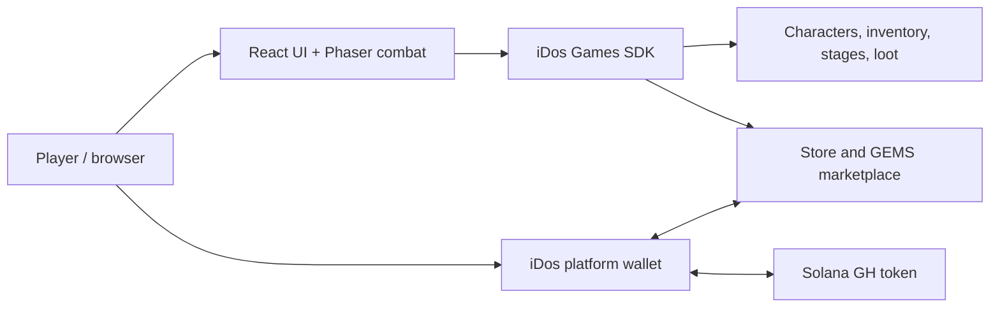

# GRIND HEROES

     

> **Build your party. Progress while AFK.** An idle RPG with automatic battles, lasting hero progression, valuable loot, and a player-driven game economy.

**[Play the live game](https://98jrcakg.idos.games/)** · [Watch the 2-minute demo](https://youtu.be/kQVqU1hUUec) · [Watch the founder pitch](https://www.loom.com/share/d6565085ef3d405696bf17fff49a7032) · [Colosseum project](https://colosseum.com/arena/projects/grind-heroes) · [Development notes](docs/feature-history/README.md)



*Actual game capture: an automatic boss fight above the stage map and five-section game menu.*

## Built for short sessions and long progression

Not everyone has hours to play every day. Grind Heroes lets players check in, collect what their heroes earned while away, make a few meaningful choices, and leave the party fighting. Coming back means stronger heroes, new gear, and another stage to push.

The current web build is playable now. It has **three acts and 30 finite stages**, a party of up to three heroes, melee and ranged combat, bosses, equipment, chests, and an in-game marketplace.

## The game loop

```text
Build a party → Fight automatically → Earn GOLD and chests
       ↑                                   ↓
Push harder stages ← Upgrade and equip ← Open loot
                             ↕
                     Keep or trade gear
```

Knight, Archer, and Mage have different combat roles. Players recruit heroes, unlock party slots, level up and equip them, then choose a stage to progress through or farm. Stage and boss chests add gear across five rarity tiers. An AFK return grants accumulated GOLD, capped at eight hours.

| Equip the party | Browse player listings |
| --- | --- |
|  |  |

## A player-driven economy

Loot creates a choice: **equip an item for the next fight, keep it for another hero, or list eligible equipment for another player.** The live iDos Marketplace supports player listings and purchases of equipment priced in **GEMS**. Sale proceeds can go back into the game economy, including gear from other players.

The **GH token lives on Solana**. Players can deposit GH through the iDos Games platform wallet into their game balance and spend that balance in the in-game Store on GEMS or Premium Chests. A Premium Chest opens into a server-rolled equipment item. Combat, item ownership, and GEMS marketplace settlement are handled by iDos game services; this build does not present equipment as on-chain NFTs or price marketplace listings in GH.

### Why Solana?

Solana gives GH a wallet-connected token network and an existing community familiar with digital assets. Its fast, low-cost transfers suit an economy players can enter and leave through deposits and withdrawals. The battle loop stays responsive because moment-to-moment gameplay runs through the game client and iDos services.

## What is playable

| Area | Current build |
| --- | --- |
| **Combat** | Automatic melee and ranged fights, stage selection, bosses, and 30 stages across three acts. |
| **Party** | Knight, Archer, and Mage; up to three active heroes; recruitment, leveling, equipment, and power. |
| **Loot** | Stage and boss chests, rarity-based equipment, inventory, and Premium Chests. |
| **Idle progress** | GOLD accumulated while away, with an eight-hour cap. |
| **Trading** | GEMS-priced equipment listings and purchases through the iDos Marketplace. |
| **GH utility** | Solana GH deposits through the platform wallet and server-backed Store offers for GEMS and Premium Chests. |

## How it is built

| Layer | Technology |
| --- | --- |
| Game simulation and rendering | Phaser 4 |
| Interface | React 19, TypeScript 5 |
| Build and local development | Vite 8 |
| Accounts, game state, and services | iDos Games SDK and host modules |
| Token network | Solana, through the GH token and iDos platform wallet |
| Verification | TypeScript typecheck and Node-based gameplay and economy tests |



### iDos Games integration

The host provides sign-in and the game session. iDos-backed characters, inventory, formation, lootboxes, Store, Marketplace, and server-side stage validation keep durable progress outside the Phaser scene. The platform wallet handles GH deposits and withdrawals; the game reads the resulting in-game GH balance for Store purchases. This lets a solo developer spend more time on combat, progression, content, and balancing.

This repository contains the **current React/Phaser hackathon client and its tests**. Title configuration and managed backend services live on iDos Games, so they are not represented as local JSON or smart contracts here. See [IDOS.md](IDOS.md) for the project map and [feature history](docs/feature-history/README.md) for implementation decisions.

## Play or run locally

**For judges:** open the [live game](https://98jrcakg.idos.games/). Choose a sign-in method when prompted; **Play as Guest** is the quickest way to try the core game. For GH already deposited through an iDos Games account, sign in with that same account.

**For developers:** use a supported Node.js release and npm. The repository has a canonical Title ID in `src/idos.title.ts`; `.env.local` selects the DEV environment for a local run.

```bash
git clone https://github.com/gordon0027/GRIND-HEROES.git
cd GRIND-HEROES
npm install
cp .env.example .env.local
npm run dev
```

```bash
npm run typecheck
npm run build
npm test
```

Local development connects to the iDos DEV Title and its backend configuration. No credentials are needed in the repository.

## Status and next steps

- [x] Three-act campaign, automatic combat, bosses, and AFK GOLD
- [x] Three-hero party, equipment progression, and chest rewards
- [x] GEMS equipment marketplace and GH Store offers
- [ ] Expand content and keep tuning progression and the economy
- [ ] Explore broader token rewards and Solana-linked item features

## Colosseum 2026

GRIND HEROES was built by a solo founder for [Colosseum's Crypto World's Fair](https://colosseum.com/arena/projects/grind-heroes), with iDos Games integration.

| Founder | Role | Contact |
| --- | --- | --- |
| Adam Tukeyev | Solo Founder & Game Developer | [Telegram](https://t.me/abidelaw) · [X](https://x.com/adam2key) · [GitHub](https://github.com/gordon0027) |

**[Live game](https://98jrcakg.idos.games/)** · [Technical demo](https://youtu.be/kQVqU1hUUec) · [Founder pitch](https://www.loom.com/share/d6565085ef3d405696bf17fff49a7032) · [Project page](https://colosseum.com/arena/projects/grind-heroes)
